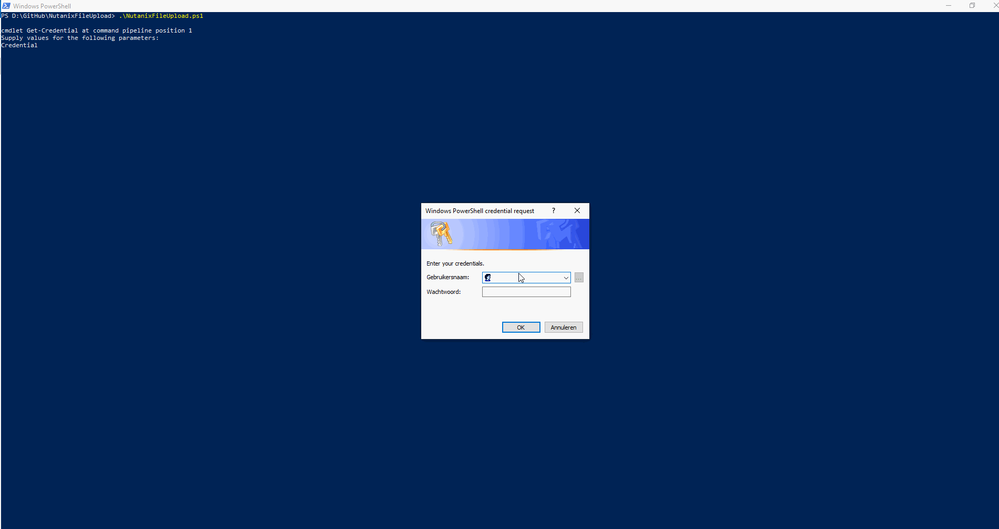

# Nutanix File Upload Tool
API based Powershell tool for uploading images to Nutanix

*Current Version 1.0.0.0*

**Requirements**
- Windows Machine with PowerShell 5
- Prism Central Credentials, Local or Directory Based, no SSH access required.
- PC / AOS on 5.9 or above for API V3

**Capabilties**
- **UI Mode** Prompts the user for all needed values.
- **Commandline Mode** Expects the values to be all specified on the commnadline

- **How to use** There are 2 methods to run:
	1. **Run NutanixFileUpload.ps1 -commnadline $true** All other values are expected to be passed also.
	2. **Run NutanixFileUpload.ps1** Prompt dialogs will take the user through the process.

- **Limitations**
	1. Tool is capped to 1MBs at all times. PS Invoke-RestMethod Upload limitation.
	2. Description always needs to be specified with commandline parameter.

# Detailed User Info #

**Commandline Mode**

Runs the full tool from commandline, no prompts. (in this example commandline mode is not enforced and EULA is still prompting)

**UI Mode**

Tool is run in commandline mode in this example

